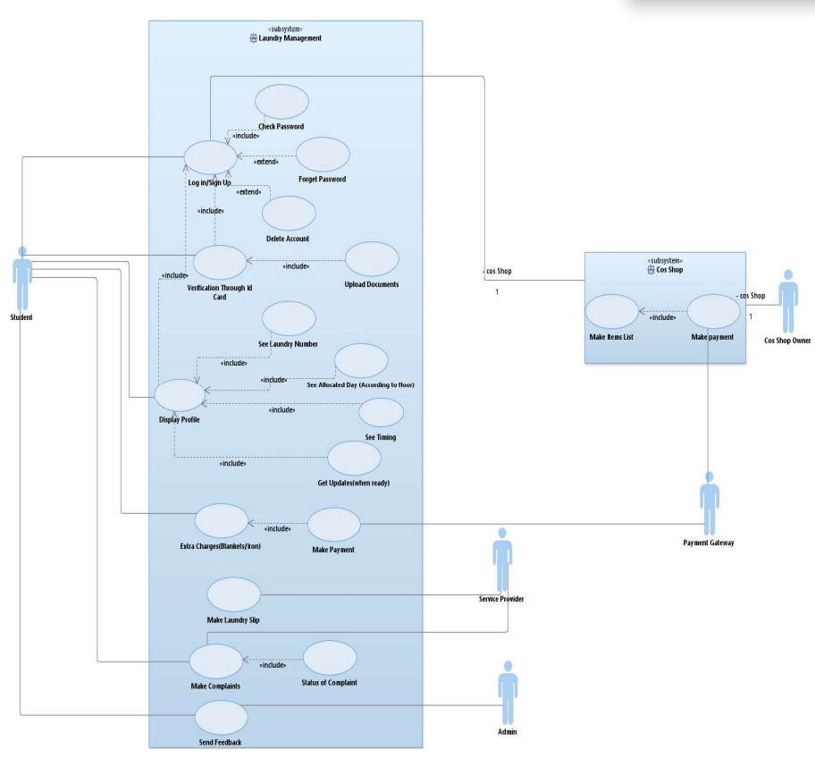
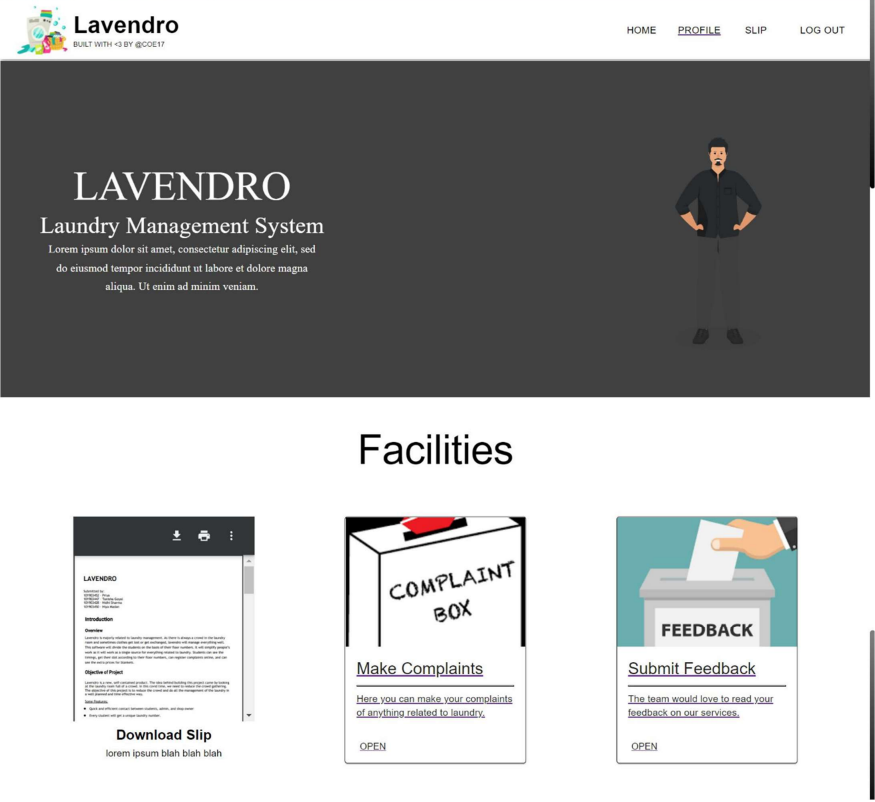
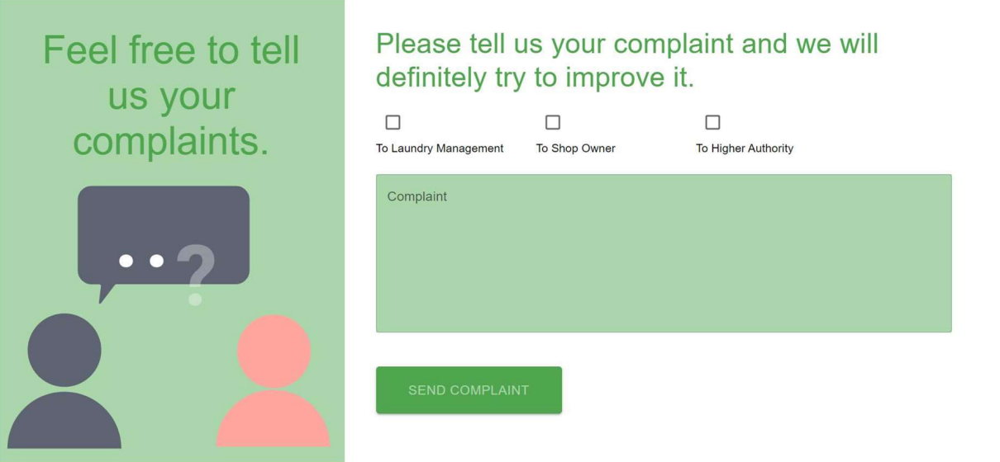

# Title: Lavendero

## 1. Methodology

## 2. Description

### Tech Stack Used

- MongoDB - Database used
- Express - Server/routing API for web app
- Node - Backend JS runtime

### API Reference

Postman Documentation: https://documenter.getpostman.com/view/13862647/2s8YzXuzL5

### Setting up the project

- Clone this repository: `https://github.com/hiyamadan/Lavendero-laundry-management.git`
- Create .env file in the root directory of the project
- Install node.js and npm on your local machine
- Install the dependencies: `npm install`

### Running the project

- Run the dev script in the terminal: `npm run dev`
  - Server starts running at http://localhost:5000
  - Server automatically restarts when any of the files are changed

## 3. Input/Output

## 4. Live Link

Link: 

## 5. Screenshot of the Interface

